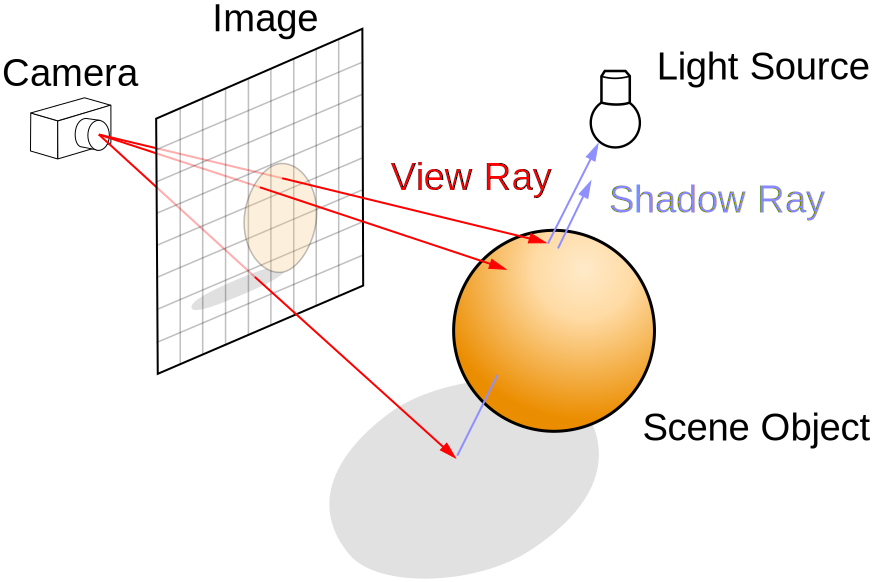

Ray-tracing is a technique most often used in film due to its heavy computational cost. With today's handware, full ray-tracing is usually not a feasible technique to used in real-time contexts, such as video games.

The advantage of the ray-tracing technique is that it simulates light in a way that is very close to our understanding of light in the real world. Using this technique means we can directly apply our understanding of how lighting is affected by physical materials, reflections and refractions. For this reason, contexts which require photorealistic image generated use the ray-tracing technique.

<!-- https://commons.wikimedia.org/wiki/File:Ray_trace_diagram.svg -->

Diagram which shows how rays cast from the camera determine the pixel colours. Henrik. "Ray Trace Diagram," <i>Wikimedia Commons</i>, 12 Apr. 2008, commons.wikimedia.org/wiki/File:Ray_trace_diagram.svg.

To perform ray-tracing, we divide the image into a rectangular grid of pixels. This defines the **resolution**, or quality of the image. For each pixel of the image, we send out a ray in the corresponding direction. This corresponds to the way light travels in vacuum travels in a straight line. When a ray hits an object, it calculates the color of that pixel based on factors like the material properties, light sources, and any reflections or refractions. This process is repeated **recursively** to achieve reflections and refractions. This gets us realistic rendering of effects like reflections and transparency.

A scene rendered by a ray-tracer. Shirley, Peter, et al. "Final Scene," <i>Ray Tracing in One Weekend</i>, July 2024, raytracing.github.io/images/img-1.23-book1-final.jpg.

<!-- https://raytracing.github.io/books/RayTracingInOneWeekend.html -->

As a simplified algorithm:
> - For each pixel on the screen:
>     - Cast a ray from the camera through this pixel into the scene.
>     - Initially, the colour of this ray is black, which corresponds to no light.
>     - Trace the ray until we find a point of intersection with some object in our scene.
>     - If the ray intersects some object in our scene:
>         - For each light source, check if the light is visible from the intersection point
>         - If the material is reflective or refractive, then we recursively branch out by casting rays in multiple directions and add their contributions to the light colour together.
>         - Combine illumination and material properties to determine the final pixel color.

## Further Reading

If this post has interested you in building your own 3D ray-tracer, I personally found [_Ray Tracing in One Weekend_](https://raytracing.github.io/books/RayTracingInOneWeekend.html) by Peter Shirley, Trevor David Black, and Steve Hollasch very helpful when starting out.

**Note:** this post has given simply an overview. There are many details that I did not fill in. Following these guides will require some prerequisite knowledge in programming; otherwise they might become difficult to follow. For complete beginners I would suggest practicing programming skills with simpler projects first!